# Приложение для услуг ЖКХ

Данный репозиторий содержит исходный код приложения для услуг ЖКХ. Это приложение предоставляет
удобный интерфейс для пользователей, чтобы они могли получать доступ к различным услугам, связанным
с жилищно-коммунальным хозяйством.

## Функциональные возможности:
- Регистрация и аутентификация пользователей
- Отправка показаний приборов учета и отслеживание истории показаний
- Отправка заявок на ЖКХ услуги
- Просмотр истории заявок
- Уведомления о передачи показаний по приборам учета
- Актуальные новости от ЖКХ

## Использованный стек технологий:

- **Kotlin**
- **Coroutines**
- **Jetpack Compose**
- **Jetpack Navigation**
- **Firebase Firestore**

# Скриншоты приложения:

- ### Заставка и экран приветствия
    
    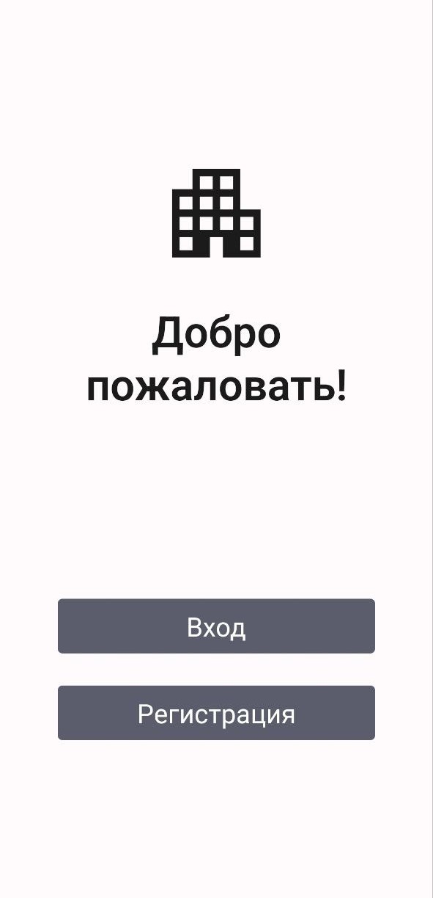

- ### Аутентификации пользователя
    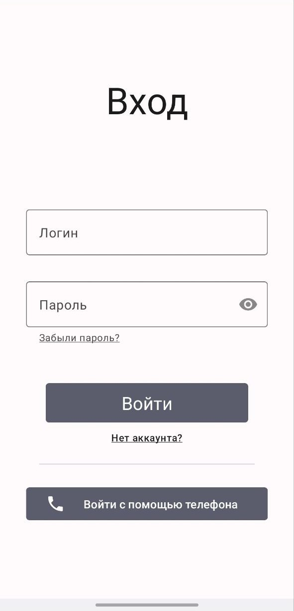
    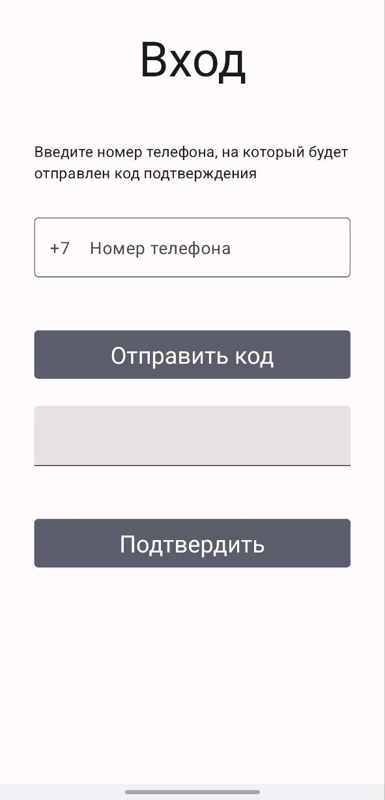

- ### Регистрация
    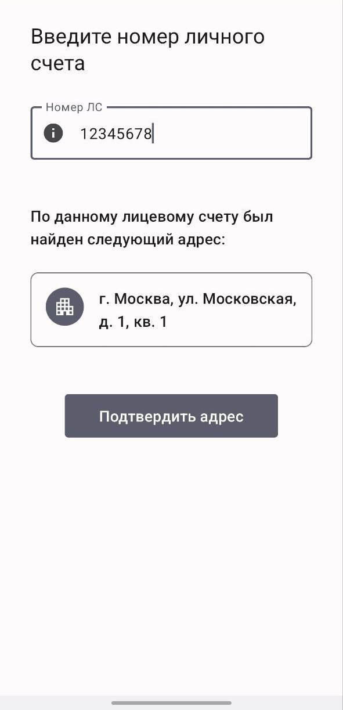
    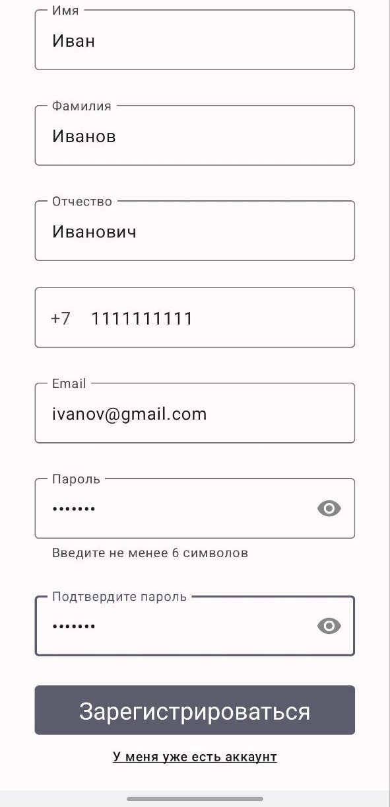

- ### Сброс пароля
    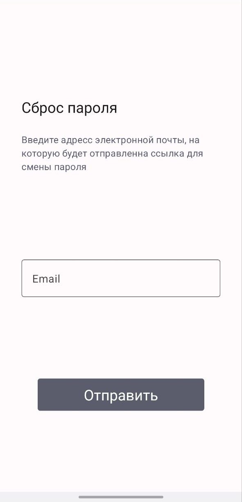

 - ### Главная
    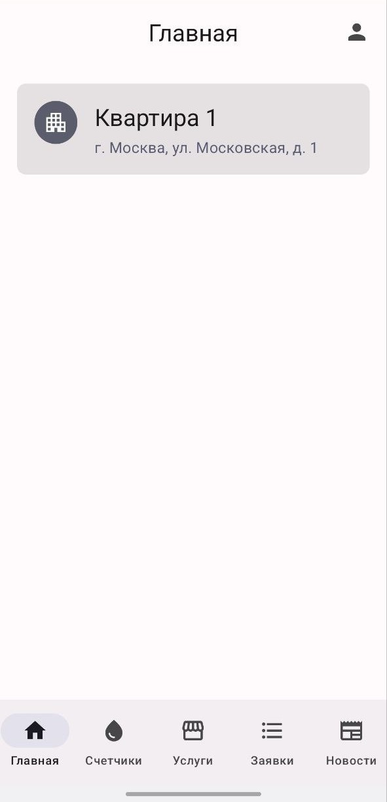

- ### Профиль
    

- ### Приборы учета
    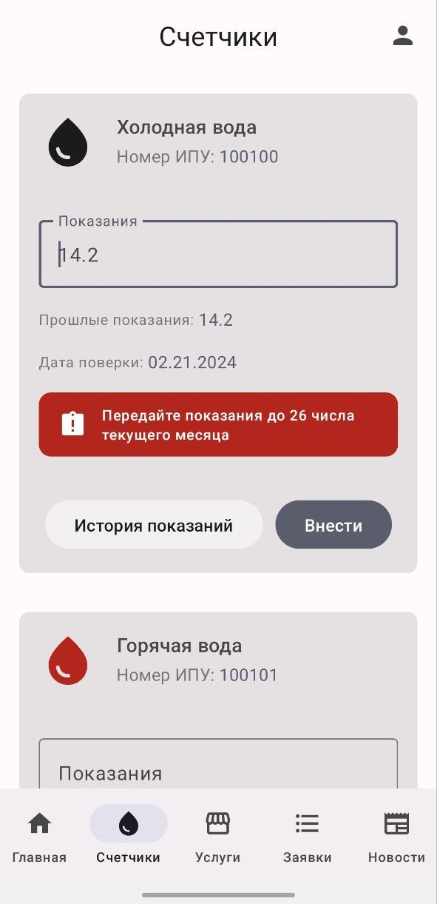
    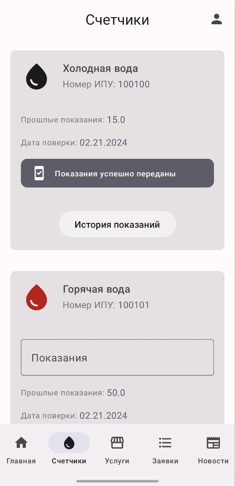
    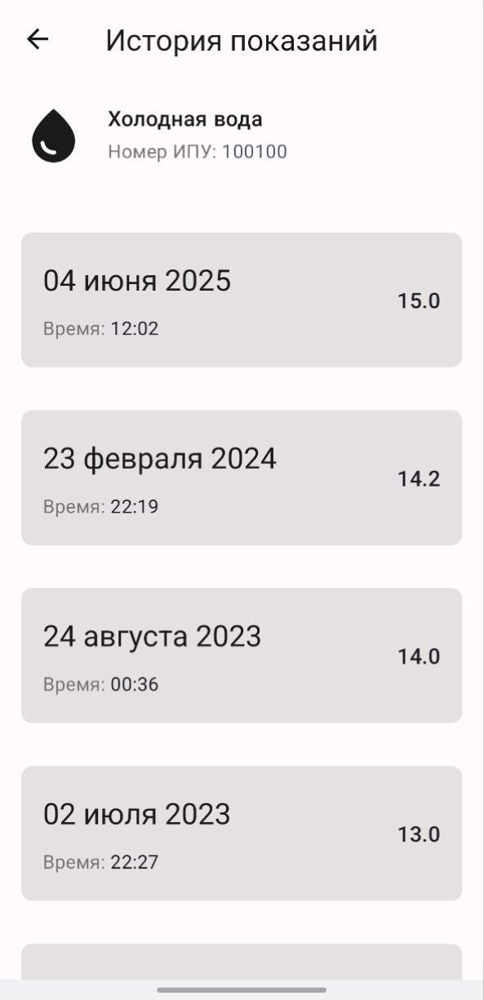

- ### Список услуг
    

- ### Заявки на услуги
    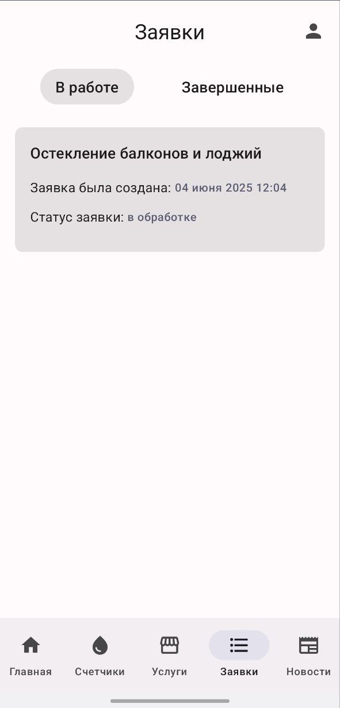
    
    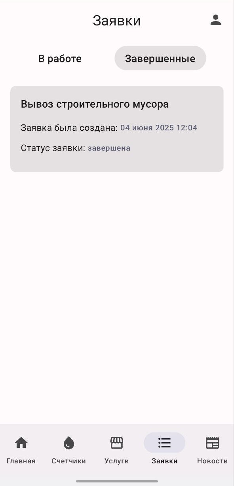 

- ### Экран новости
    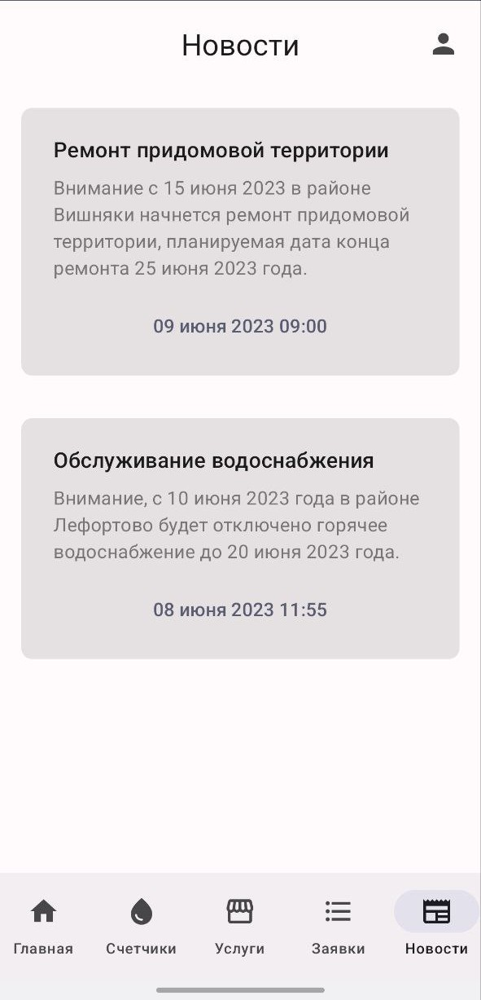

